## Cel Shading / Toon Shading with Reflection and Refraction
### DH2323 Project
Bosen Cheng
KTH Royal Institute of Technology

> Cel Shading or Toon Shading is a type of non-photorealistic rendering designed to make 3-D computer graphics appear to be flat by using less shading color instead of a shade gradient or tints and shades.

### Part 1: Lad Work Extension

*Required Package: SDL2, GLM from Open GL, OpenCV*

*Environment: VS2019*

We have achieved the basic functions of a ray tracer and a rasterizer in the lab. Here, I will extend the lab work to implement a simple cel shader to illustrate the principles of such a stylized shader. 

Generally, we know that in the cartoon, or 2D animation, the models would have fewer color tones, and their outlines are explicitly drawn. Thus, I have two objects to achieve.

Less color is relatively easy to achieve. Here, since the indirect light is a constant in the lab, I only need to make the continuous direct light discrete by making the angle dot product discrete. For the simplest one is to display one color, which is the model's original color. This can be treated as a certain type of cel shading style since some 2D animation like *South Park* adopt such style for its characters (one tone cel shader is an imitation of this style).  

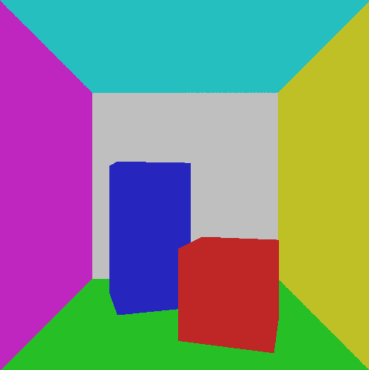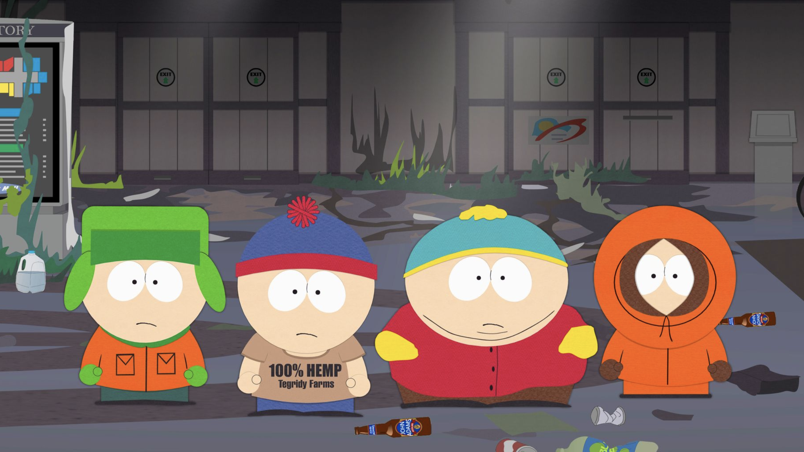
Figure 1: One Tone Cel Shading and 2D Cartoon *South Park*

#### **Color**
Here, I divided the continuous color into discrete tones. Most 2D cartoon animations or games would have 2 to 3 different colors two show the tones like highlight and shadow. 

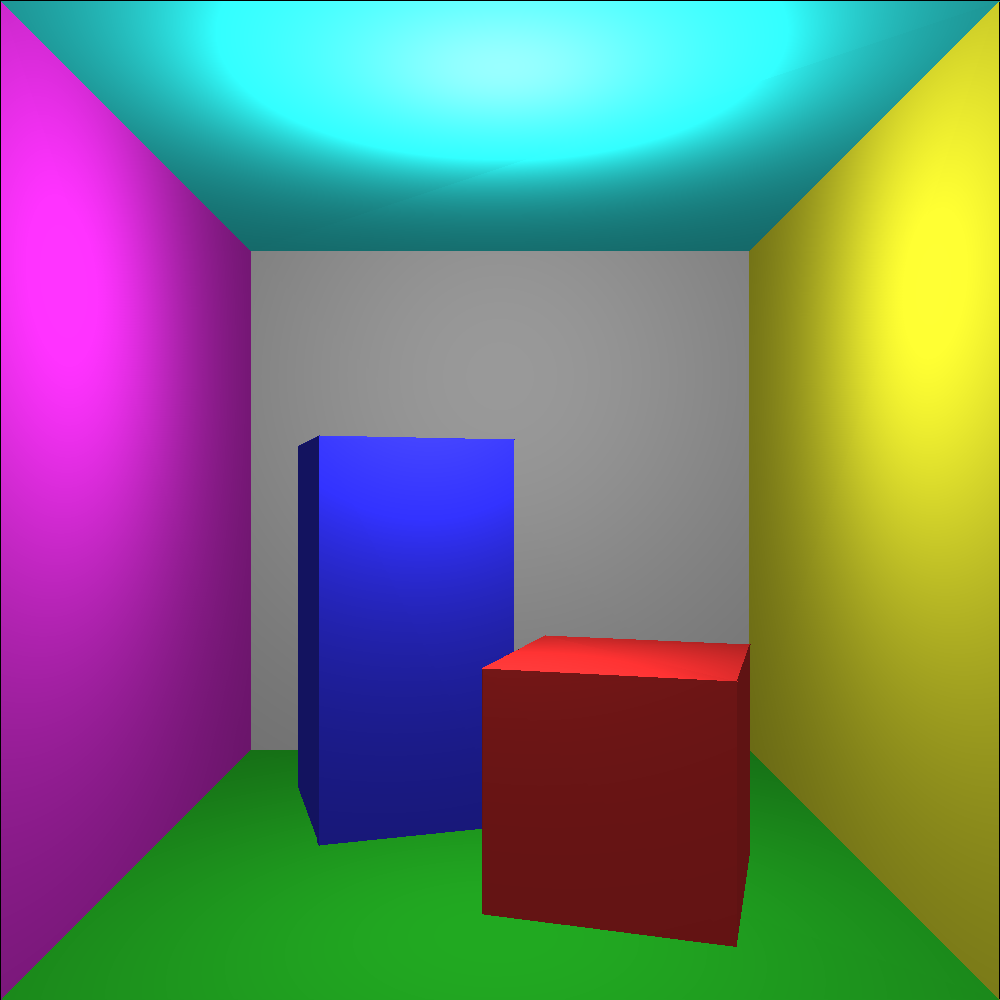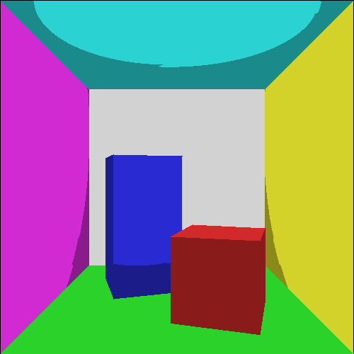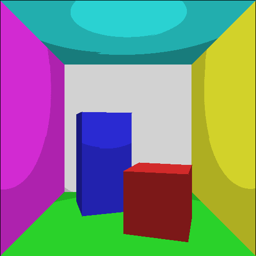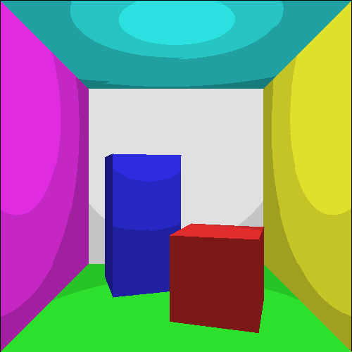
Figure 2: Original rasterization with Cel Shading (2 to 4 colors)

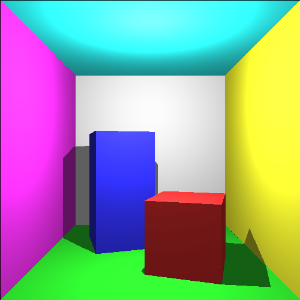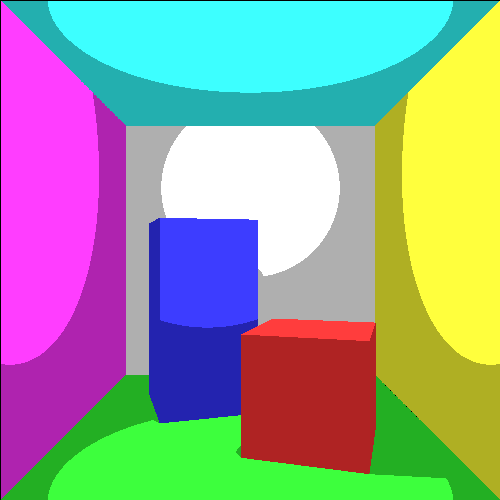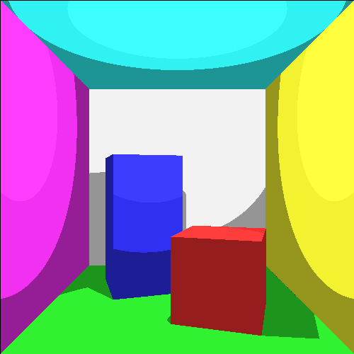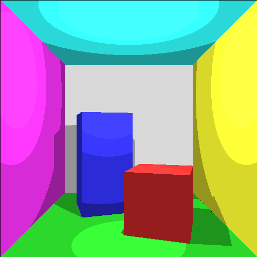
Figure 3: Original Ray Tracing with Cel Shading (2 to 4 colors)

**Note:** In ray tracing, we can actually calculate the shadow independently by adding the black color, but this means that we actually have one more color.

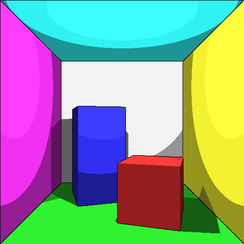
Figure 4: Ray Tracing with Cel Shading and Edge (1 and 2 pixel) (Canny Edge Detection)

#### **Edge Detection**
For edge detection, there are several ways to achieve that. 

One way is to use computer vision edge detection algorithm on the depth information which is shown below. Thus, I chose to use the Canny algorithm with OpenCV to achieve edge detection here in this project. However, there are some problems. The results heavily depend on the parameters you sent to the edge detection algorithm. The follow figures shows the results when we use the depth buffer's depth information as input, and the gray color converted from RGB. (calculated using default OpenCV equation: $Gray = 0.1140 \times color.b + 0.5870 \times color.g + 0.2989 \times color.r$) 

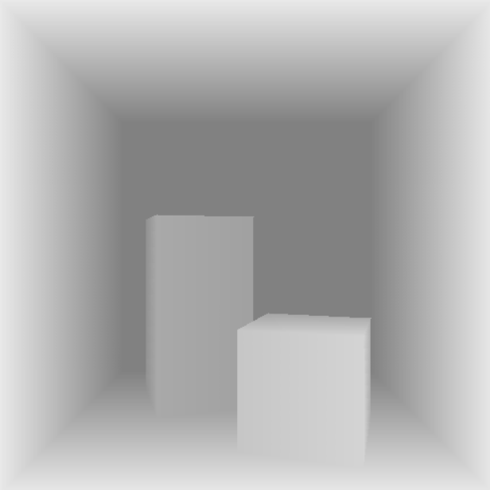
Figure 4: Rasterization Edge using Canny Edge Detection (and input depth image). The problem with the edge detection is obvious, it cannot distinguish between the object the place where the object touches the ground.  

### Part 2: Cel Shading with Reflection and Refraction
