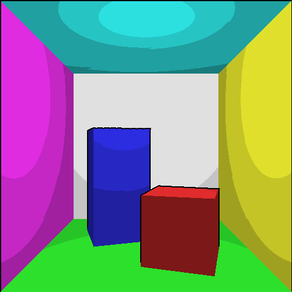

## Cel Shading / Toon Shading on Glass and Metal Objects
### DH2323 Project
Bosen Cheng
KTH Royal Institute of Technology

> Cel Shading or Toon Shading is a type of non-photorealistic rendering designed to make 3-D computer graphics appear to be flat by using less shading color instead of a shade gradient or tints and shades.

- [Cel Shading / Toon Shading on Glass and Metal Objects](#cel-shading--toon-shading-on-glass-and-metal-objects)
  - [DH2323 Project](#dh2323-project)
  - [Part 1: Lad Work Extension](#part-1-lad-work-extension)
    - [**Color**](#color)
    - [**Edge Detection**](#edge-detection)
  - [Part 1.5: Cheat Way Achieving Cel Shading without Outline](#part-15-cheat-way-achieving-cel-shading-without-outline)
  - [Part 2: Cel Shading with Reflection and Refraction in Blender](#part-2-cel-shading-with-reflection-and-refraction-in-blender)
  - [Part 3: Cel Shading with Reflection and Refraction in Unity](#part-3-cel-shading-with-reflection-and-refraction-in-unity)

### Part 1: Lad Work Extension

*Required Package: SDL2, GLM from Open GL, OpenCV*

*Environment: VS2019*

We have achieved the basic functions of a ray tracer and a rasterizer in the lab. Here, I will extend the lab work to implement a simple cel shader to illustrate the principles of such a stylized shader. 

Generally, we know that in the cartoon, or 2D animation, the models would have fewer color tones, and their outlines are explicitly drawn. Thus, I have two objects to achieve.

Less color is relatively easy to achieve. Here, since the indirect light is a constant in the lab, I only need to make the continuous direct light discrete by making the angle dot product discrete. For the simplest one is to display one color, which is the model's original color. This can be treated as a certain type of cel shading style since some 2D animation like *South Park* adopt such style for its characters (one tone cel shader is an imitation of this style).  

Figure 1: One Tone Cel Shading and 2D Cartoon *South Park*

#### **Color**
Here, I divided the continuous color into discrete tones. Most 2D cartoon animations or games would have 2 to 3 different colors two show the tones like highlight and shadow. 

Figure 2: Original rasterization with Cel Shading (2 to 4 colors)

Figure 3: Original Ray Tracing with Cel Shading (2 to 4 colors)

**Note:** In ray tracing, we can actually calculate the shadow independently by adding the black color, but this means that we actually have one more color.

Figure 4: Ray Tracing with Cel Shading and Edge (1 and 2 pixel) (Canny Edge Detection)

#### **Edge Detection**
For edge detection, there are several ways to achieve that. 

One way is to use computer vision edge detection algorithm on the depth information which is shown below. Thus, I chose to use the Canny algorithm with OpenCV to achieve edge detection here in this project. However, there are some problems. The results heavily depend on the parameters you sent to the edge detection algorithm. The follow figures shows the results when we use the depth buffer's depth information as input, and the gray color converted from RGB. (calculated using default OpenCV equation: $Gray = 0.1140 \times color.b + 0.5870 \times color.g + 0.2989 \times color.r$) 

Figure 5: Rasterization Edge using Canny Edge Detection (and input depth image). The problem with the edge detection is obvious, it cannot distinguish between the object the place where the object touches the ground.  

### Part 1.5: Cheat Way Achieving Cel Shading without Outline 

Here, I noticed a cheat method to achieve the cel shading using path tracing. The convenience here is that, with path tracing, one can easily design the glass and metal objects' materials with reflection and refraction. The demonstration here is a Cornell Box with some glass and metal balls. This part is built with an existing simple path tracing project from Yiheng Zhang ([GitHub Repo](https://github.com/StanwieCB/Path-Tracer)). What I did is to make the dot product of the light vector and surface normal discrete, thus reducing the color tunes. The modification is done inside the BSDF calculation section.

### Part 2: Cel Shading with Reflection and Refraction in Blender

Above Figures are designed using Blender.

 

For the glass material, the shader is designed with the above nodes. The basic process is to modify the color output from an existing glass material shader. Firstly, the glass material is the base to generate the color for our cup object, and then I used the color ramp node to make the continuous color on the glass discrete. Next, I mixed this color with a transparent node and set the Blend mode to Alpha Blend to offer a transparent feeling.

The limitation is that since the Alpha Blend actually mixes the forward object's color with obscured objects' color, there is no real refraction with this method. 

For the metal teapot, I approached it slightly differently. Again, I start with an given material (specular node). With the color coming from this node, I used to color ramp nodes, one is to set its surface color (top node), the other one (bottom node) is to create the discrete color for the highlight and shadow of the metal object.

The limitation is obvious, this process cannot reflect the surrounding objects' colors. 

### Part 3: Cel Shading with Reflection and Refraction in Unity

For Unity shader, it is much harder to achieve a satisfying effect. Here, I used the "step" to make the color in the shader discrete which is not hard. The hardest parts are the specular light and outline of the models. As for the metal teapot, the CelMetal.shader shader calculates the specular light and highlights in addition. The glass cup used the CalGlass.shader which calculates the specular light, the rim light caused by the Fresnel effect. 

In Unity shader, the easier way to implement the outline is to extend the model along its vertex normal vector a little bit, then color it with black. Namely, the shader will render twice, the first time is to draw the cel-shaded color, the second time is to draw the black outline. I used this way to draw Unity's Kyle robot and the teapot.

However, this function is not working on the transparent as expected due to the alpha channel. I haven't found an appropriate method to draw the outline for a glass object.

References for Unity part: 

1. [Minions Art Tutorials](https://minionsart.github.io/tutorials/)
2. [Cel-shading: some tricks that you might not know about](https://torchinsky.me/cel-shading/)
3. [Cel Shading / 卡通渲染(下)](http://zhangwenli.com/blog/2017/03/21/cartoon-shading-2/)